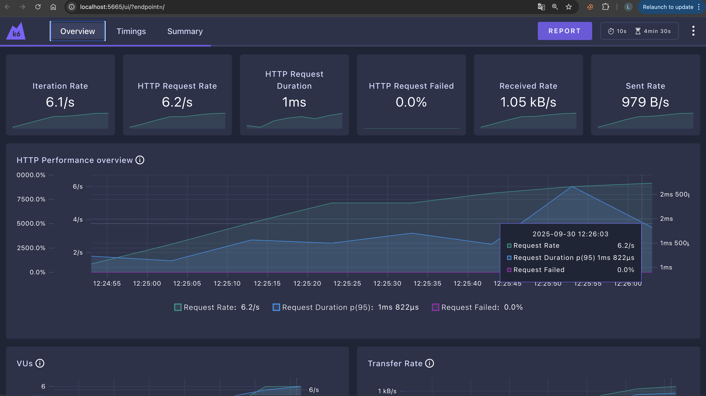

# k6 Load Test for Bitonic API

Simple load testing for the Bitonic Sequence Generator API with real-time dashboard.

### Example


## Quick Start

1. **Install k6 with dashboard support:**
   ```bash
   # Install Go (required for xk6-dashboard)
   # macOS: brew install go
   # Ubuntu: sudo apt install golang-go
   
   # Install xk6
   go install go.k6.io/xk6/cmd/xk6@latest
   
   # Build k6 with dashboard
   xk6 build --with github.com/grafana/xk6-dashboard@latest
   
   # Move to PATH (optional)
   sudo mv ./k6 /usr/local/bin/k6-dashboard
   ```

2. **Start your Bitonic API:**
   ```bash
   cd bitonic-api
   zig build run
   ```

3. **Run the load test:**
   ```bash
   cd k6-tests
   ./run-load-test.sh
   ```

4. **View dashboard:** Open http://localhost:5665 in your browser

## Test Profile

- **Ramp up:** 30s to reach 5 users
- **Load phase:** 2 minutes at 10 users
- **Stress phase:** 1 minute at 20 users  
- **Ramp down:** 30s to 0 users

## What it tests

- POST requests to `/bitonic` endpoint
- JSON payloads based on Bruno spec
- Response validation (200 status, valid JSON)
- Performance thresholds (95% under 1s, <10% errors)

## Manual run

```bash
# With dashboard
k6 run --out dashboard simple-load-test.js

# Without dashboard  
k6 run simple-load-test.js

# Custom target
BASE_URL=http://staging.example.com ./run-load-test.sh
```

## Dashboard Features

- Real-time metrics and graphs
- Request rate, response time, error rate
- Virtual user activity
- Performance thresholds monitoring

That's it! Simple load testing with visual monitoring.